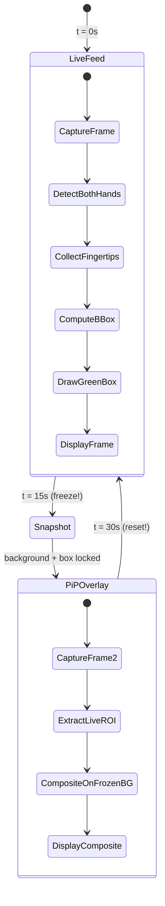
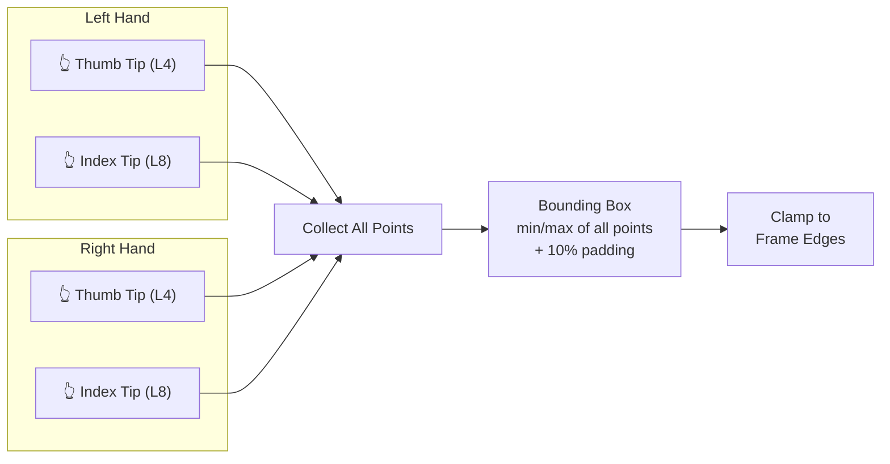
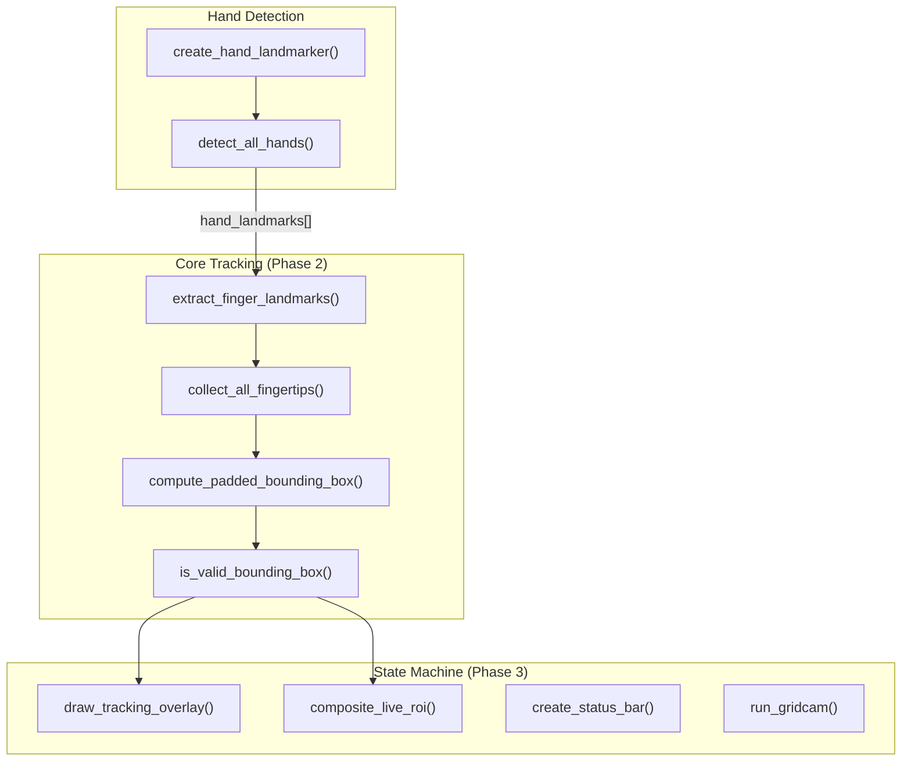

# 🎥 Gridcam — 30-Second Cyclic Camera State Machine

A Python application using **OpenCV** and **MediaPipe Hands** that tracks both hands to define a bounding box grid, then composites a live Region of Interest onto a frozen background in a 30-second cycle.

---

## How It Works

Gridcam runs a continuous **30-second loop** with two states:



| Time | State | What You See |
|---|---|---|
| **0–15s** | Live Feed | Your webcam with a green bounding box tracking your fingertips |
| **At 15s** | Transition | Background freezes, bounding box coordinates lock |
| **15–30s** | PiP Overlay | Frozen background with your live hand composited inside the locked box |
| **At 30s** | Reset | Cycle restarts from the beginning |

---

## Dual-Hand Tracking

Gridcam tracks **both hands simultaneously** using thumb tip (Landmark 4) and index finger tip (Landmark 8) from each hand:



- **1 hand** → small box around your thumb + index finger
- **2 hands** → large grid spanning both hands (each hand acts as a corner)

---

## Architecture



| Function | Responsibility | Lines |
|---|---|---|
| `extract_finger_landmarks()` | Reads Landmark 4 & 8 from one hand | ~10 |
| `collect_all_fingertips()` | Gathers tips from all detected hands | ~12 |
| `compute_padded_bounding_box()` | Min/max of all points + 10% padding, clamped | ~15 |
| `is_valid_bounding_box()` | Guards against zero-area boxes | ~3 |
| `create_hand_landmarker()` | Configures MediaPipe Tasks API (VIDEO mode, 2 hands) | ~12 |
| `detect_all_hands()` | Runs detection, returns all hand landmarks | ~10 |

---

## Setup

### Prerequisites

- Python 3.10+
- Webcam connected to your machine

### Installation

```bash
# Clone the repo
git clone https://github.com/RenjiroEgan/Gridcam.git
cd Gridcam

# Install dependencies
pip install -r requirements.txt

# Download the MediaPipe hand landmarker model (~7.8 MB)
# Windows (PowerShell):
Invoke-WebRequest -Uri "https://storage.googleapis.com/mediapipe-models/hand_landmarker/hand_landmarker/float16/latest/hand_landmarker.task" -OutFile "hand_landmarker.task"

# macOS / Linux:
curl -L -o hand_landmarker.task "https://storage.googleapis.com/mediapipe-models/hand_landmarker/hand_landmarker/float16/latest/hand_landmarker.task"
```

### Run

```bash
python main.py
```

### Controls

| Key | Action |
|---|---|
| `q` | Quit the application |
| `ESC` | Quit the application |

---

## Project Plan

### Phase Status

| Phase | Description | Status |
|---|---|---|
| **Phase 1** | Environment Setup (`requirements.txt`, model download) | ✅ Complete |
| **Phase 2** | Core Tracking Logic (dual-hand, bounding box, validation) | ✅ Complete |
| **Phase 3** | Temporal State Machine (30s cycle, freeze, PiP compositing) | ✅ Complete |
| **Phase 4** | Documentation (this README) | ✅ Complete |
| **Phase 5** | Verification (85+ second run, error-free confirmation) | ✅ Complete |

### Temporal State Machine Logic (Phase 3)

```
elapsed = time.time() - cycle_start

if elapsed >= 30s           → RESET cycle
elif elapsed < 15s          → STATE A: live feed + green tracking box
elif frozen_bg is None      → TRANSITION: freeze background + lock box (once)
else                        → STATE B: frozen bg + live ROI composite
```

### Matrix Slicing for PiP Compositing (Phase 3)

```python
composite = frozen_bg.copy()
composite[y_min:y_max, x_min:x_max] = live_frame[y_min:y_max, x_min:x_max]
```

Both slices use the same locked coordinates, so dimensions always match — no `ValueError` possible.

---

## Dependencies

| Package | Purpose |
|---|---|
| `opencv-python` | Camera capture, frame rendering, window display |
| `mediapipe` | Hand landmark detection (Tasks API) |
| `numpy` | Image array operations |

---

## License

MIT
