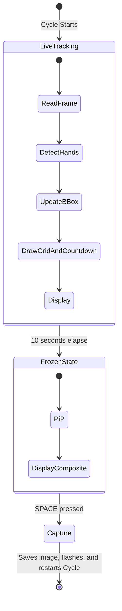
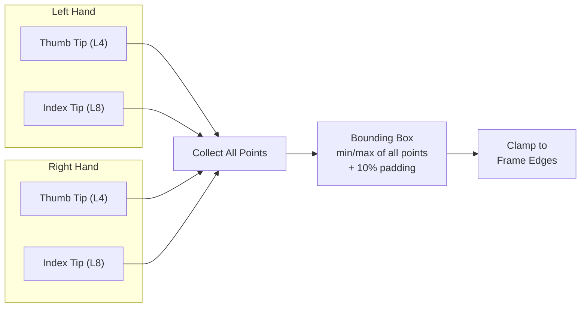
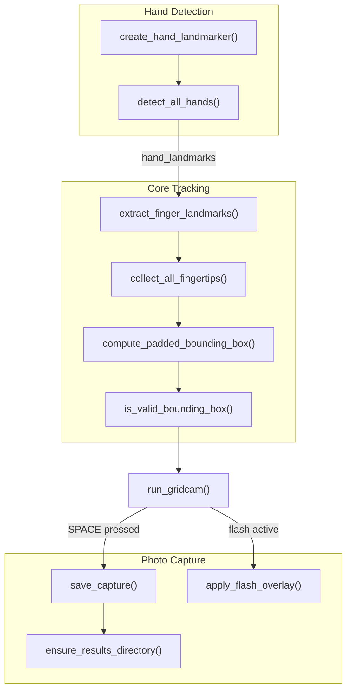

# Gridcam Photo Capture with Dual Hand Tracking

A Python application using OpenCV and MediaPipe Hands that tracks both hands to define a bounding box grid on your live webcam feed. 

## How It Works

Gridcam runs in cycles consisting of a live countdown, a freeze state with Picture in Picture, and a capture phase.



| State | What Happens |
|---|---|
| 0 to 10s (Live) | Live camera feed. A countdown appears in the center during the last 5 seconds. The green bounding box tracks your fingertips. |
| 10s+ (Frozen) | The background outside the grid freezes indefinitely. Inside the grid remains live (Picture in Picture). |
| Capture (SPACE) | While frozen, press SPACE to capture the photo. A flash animation plays, the image with the grid is saved to the Results Test folder, and the 10s cycle restarts immediately. |

## Dual Hand Tracking

Gridcam tracks thumb tip (Landmark 4) and index finger tip (Landmark 8) from both hands to define the bounding box:



## Architecture



| Function | What It Does |
|---|---|
| `extract_finger_landmarks()` | Reads Landmark 4 and 8 from one hand |
| `collect_all_fingertips()` | Gathers tips from all detected hands |
| `compute_padded_bounding_box()` | Min/max of all points + 10% padding, clamped to frame |
| `is_valid_bounding_box()` | Guards against zero area boxes |
| `create_hand_landmarker()` | Configures MediaPipe Tasks API (VIDEO mode, 2 hands) |
| `detect_all_hands()` | Runs detection, returns all hand landmarks |
| `save_capture()` | Saves the frame as PNG to Results Test folder |
| `apply_flash_overlay()` | White flash effect that fades over several frames |
| `run_gridcam()` | Main loop with 10s tracking, freeze, capture, and flash |

## Setup

### Prerequisites

* Python 3.10+
* Webcam connected to your machine

### Installation

```bash
# Clone the repo
git clone https://github.com/RenjiroEgan/Gridcam.git
cd Gridcam

# Install dependencies
pip install -r requirements.txt

# Download the MediaPipe hand landmarker model (~7.8 MB)
# Windows (PowerShell):
Invoke-WebRequest -Uri "https://storage.googleapis.com/mediapipe-models/hand_landmarker/hand_landmarker/float16/latest/hand_landmarker.task" -OutFile "hand_landmarker.task"

# macOS / Linux:
curl -L -o hand_landmarker.task "https://storage.googleapis.com/mediapipe-models/hand_landmarker/hand_landmarker/float16/latest/hand_landmarker.task"
```

### Run

```bash
python main.py
```

### Controls

| Key | Action |
|---|---|
| SPACE | Capture photo during the Frozen State |
| q | Quit |
| ESC | Quit |
